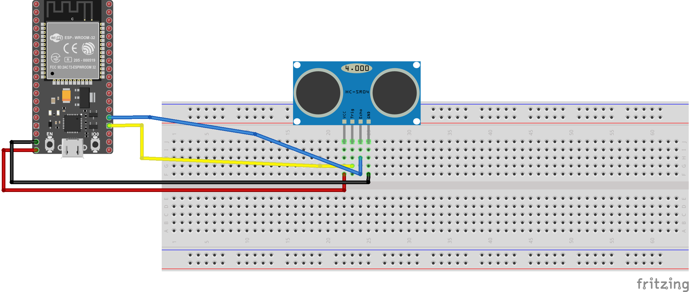
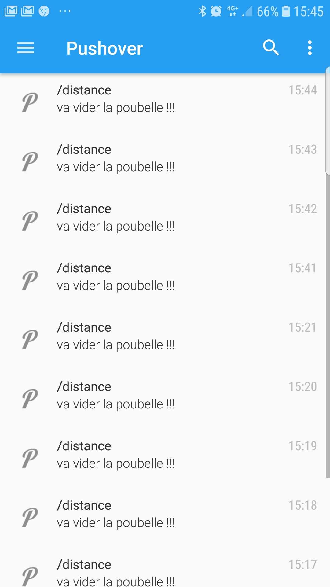

# Trash-Pushover

# Schema montage

# Bibliothèques

#include <uTimerLib.h>

#include <HCSR04.h>

#include <Adafruit_MQTT.h>
#include <Adafruit_MQTT_Client.h>

#include <WiFi.h>

# Node red

# liste composants
+ 1 HCSR04
+ 1 ESP 32
+ 4 cables male/femelle
+ 1 cable micro USB
+ 1 breadboard

